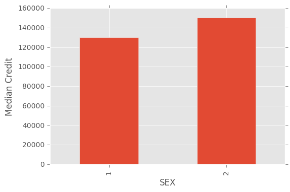
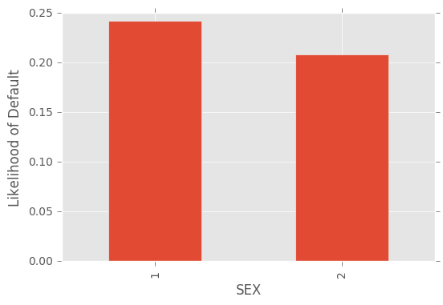
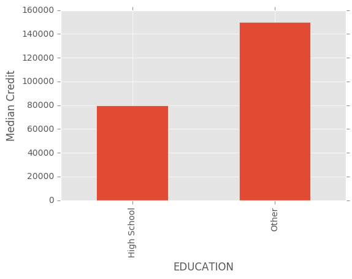
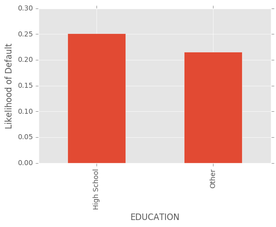
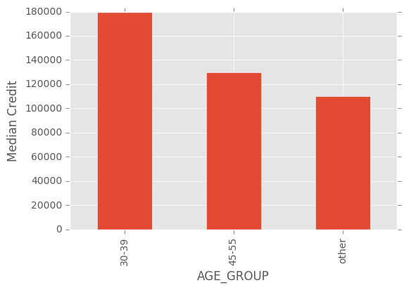
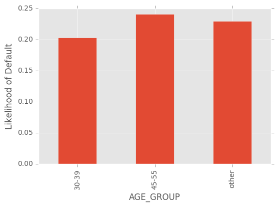

```python
import pandas as pd
import matplotlib
import matplotlib.pyplot as plt
matplotlib.style.use('ggplot')
```


```python
df = pd.read_excel("default of credit card clients.xls", skiprows=1)
```

The median amount of credit and the likelihood of default for

Males vs. Females: (Male is 1, Female is 2)


```python
plot0 = df.groupby("SEX")["LIMIT_BAL"].median().plot(kind="bar")
plot0.set_ylabel("Median Credit")
plt.show()
```





```python
plot1 = df.groupby("SEX")["default payment next month"].mean().plot(kind="bar")
plot1.set_ylabel("Likelihood of Default")
plt.show()
```





High School vs. College and Higher:


```python
df["EDUCATION"] = df["EDUCATION"].apply(lambda x: 'High School' if x == 3 else 'Other')
plot2 = df.groupby("EDUCATION")["LIMIT_BAL"].median().plot(kind="bar")
plot2.set_ylabel("Median Credit")
plt.show()
```





```python
plot3 = df.groupby("EDUCATION")["default payment next month"].mean().plot(kind="bar")
plot3.set_ylabel("Likelihood of Default")
plt.show()
```





Age 30-39 vs 45-55:


```python
def ageGroup(age):
    age = int(age)
    if (age >= 30) & (age <= 39):
        return "30-39"
    elif (age >= 45) & (age <= 55):
        return "45-55"
    else:
        return "other"
    
df["AGE_GROUP"] = df.AGE.apply(lambda x: ageGroup(x))

plot4 = df.groupby("AGE_GROUP")["LIMIT_BAL"].median().plot(kind="bar")
plot4.set_ylabel("Median Credit")
plt.show()
```





```python
plot5 = df.groupby("AGE_GROUP")["default payment next month"].mean().plot(kind="bar")
plot5.set_ylabel("Likelihood of Default")
plt.show()
```





```python

```
